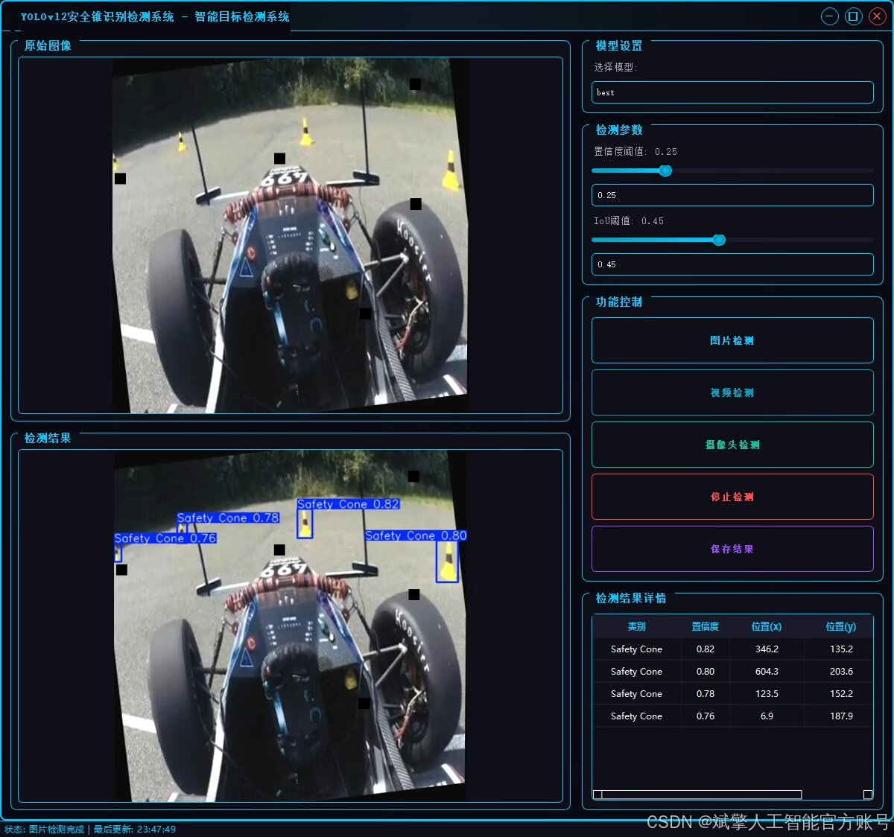
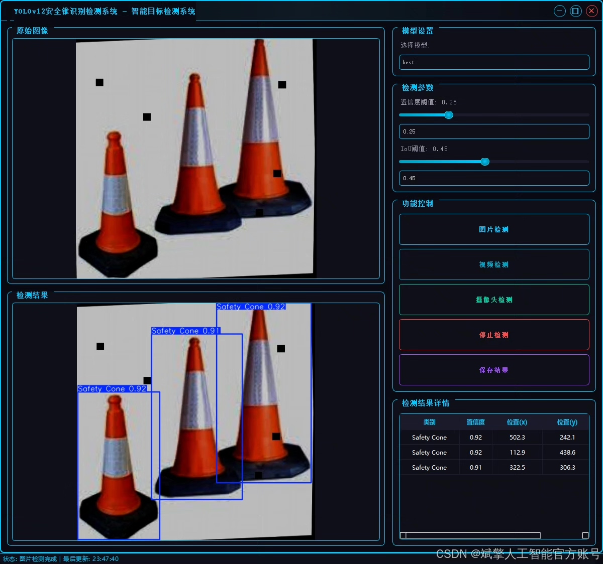
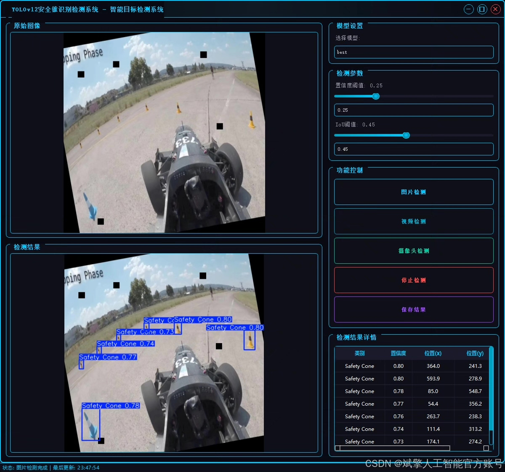
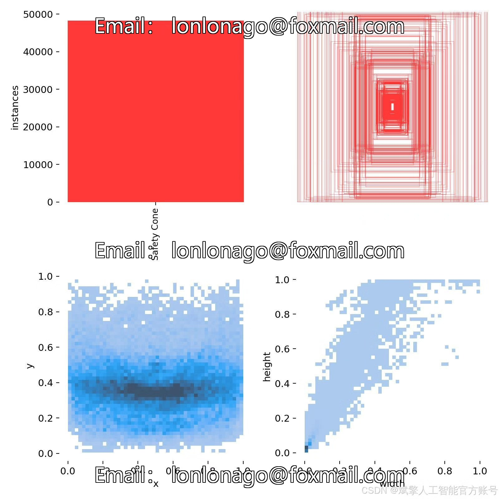
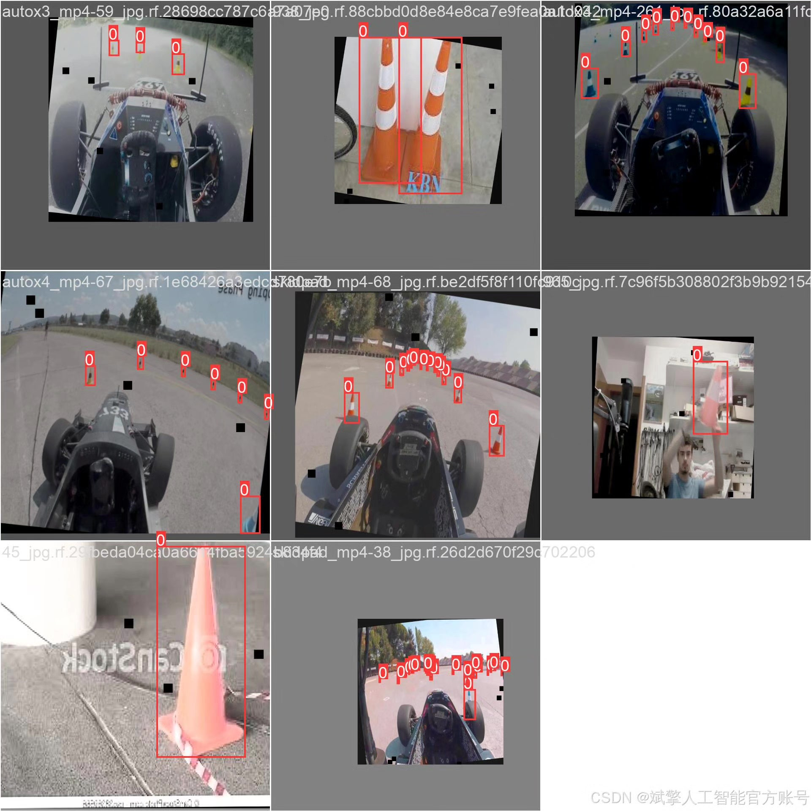
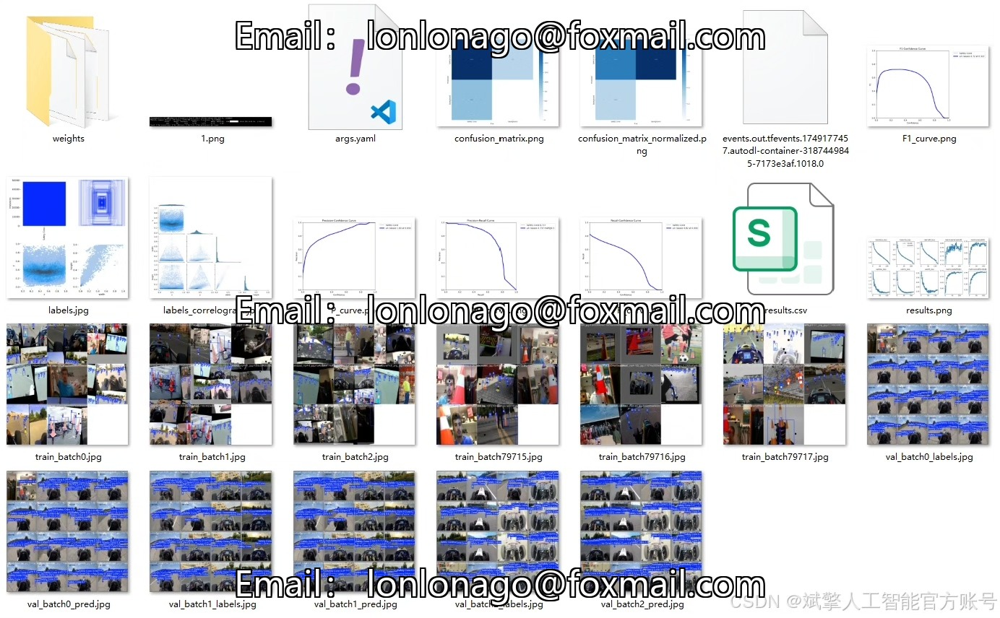
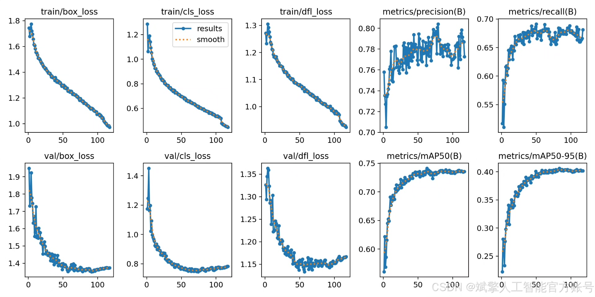
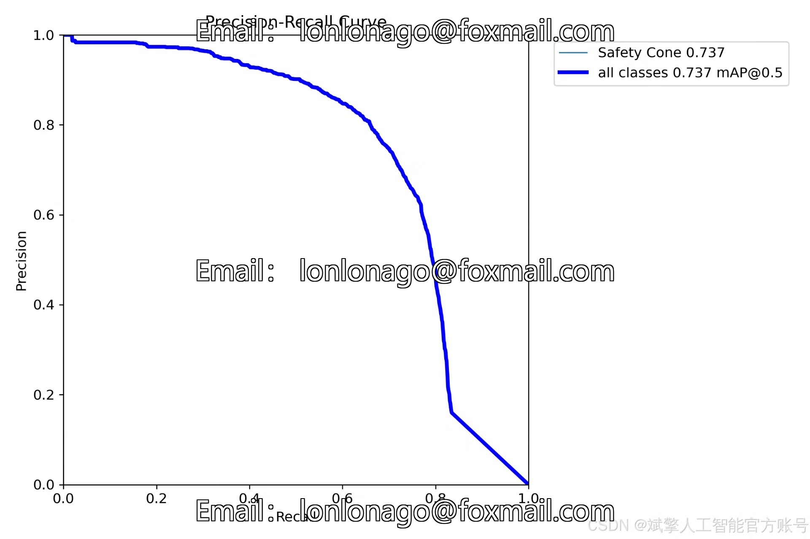
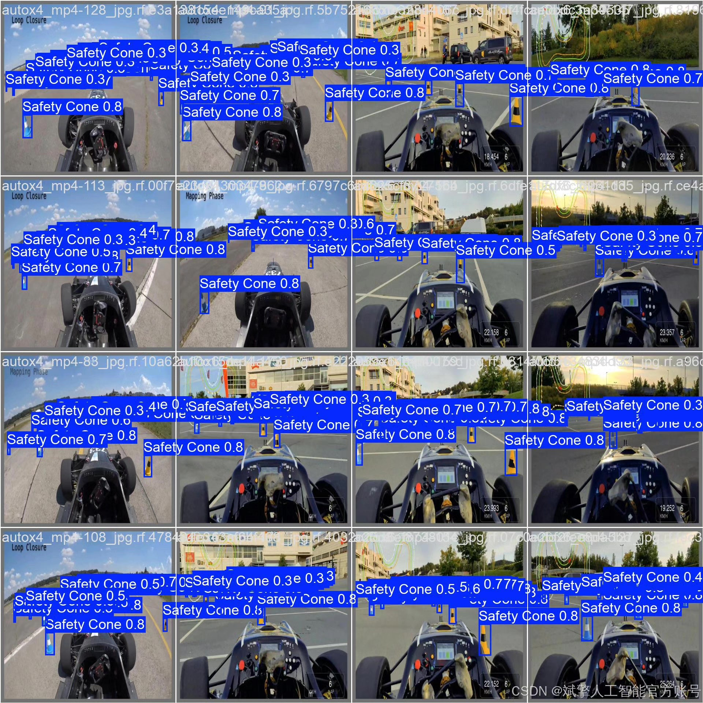

# YOLOv12 Safety Cone Recognition System

## Body

YOLOv12 Safety Cone Recognition System Based on Deep Learning YOLOv12: A High-Efficiency Safety Cone Recognition and Detection System (YOLOv12+YOLO dataset + UI interface + login registration interface + Python project source code + model)

This paper designs and implements a high-efficiency safety cone recognition and detection system based on the YOLOv12 deep learning framework. The system achieves real-time precise detection of safety cone targets through the integration of the YOLOv12 algorithm, customized YOLO dataset (including a training set of 5960 images, a validation set of 341 images, and a test set of 170 images), and a user-friendly UI interface. The system also includes login registration functionality. Experimental results show that the system performs excellently in terms of accuracy, recall rate, and real-time performance, and can be widely applied in fields such as road construction and traffic management, providing intelligent solutions for safety protection.

✅ User Login Registration: Supports password verification and security validation.
✅ Three detection modes: Based on the YOLOv12 model, supports image, video, and real-time camera detection, accurately recognizing targets.
✅ Dual-screen comparison: Displays the original scene and detection results simultaneously on the screen.
✅ Data visualization: Real-time table displaying the category, confidence, and coordinates of detected targets.
✅ Intelligent parameter adjustment: Offers a confidence slide bar to dynamically optimize detection accuracy, adapting to different scene requirements.
✅ Sci-fi style interactive interface: Dark theme combined with dynamic light effects, reducing visual fatigue and enhancing operational experience.

## Images

## Payment

Here is a pay link on Stripe ( https://buy.stripe.com/3cs8yP7sY87d0vu9AB ). Please contact me lonlonago@foxmail.com after funding $89, and I will send you a complete data files , thank you!

